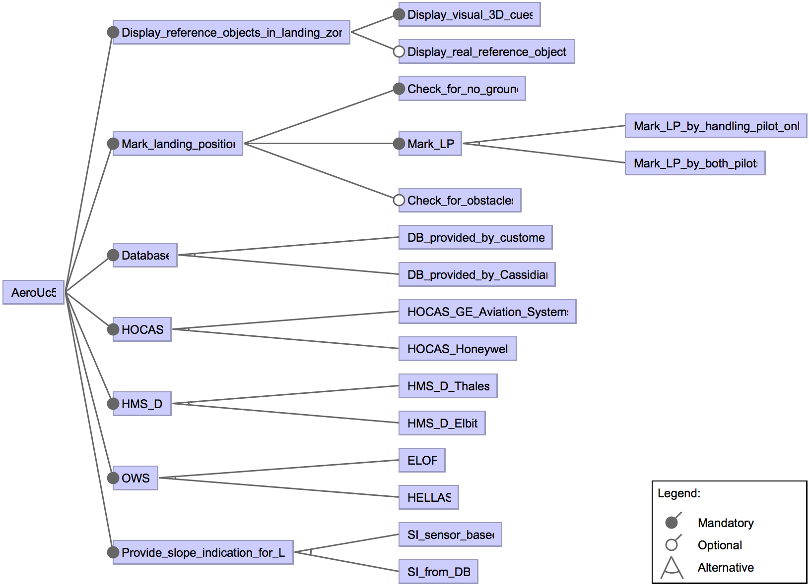

# Sferion(TM) Aero UC5


## Description

Sferion(TM) is an industrial situational awareness suite for helicopters flying in degraded visual environments. The landing symbology function supports the pilot during the landing approach by marking the intended landing position on ground using a head-tracked Helmet Mounted Sight and Display (HMS/D) and Hands On Collective And Stick (HOCAS). Depending on the selected feature, the landing may be marked by the handling pilot only or by bots pilots. The spatial awareness is enhanced during the final landing approach by displaying 3D conformal visual cues on the helmet with optionally real reference of the object. The ground (and optionally obstacles) in the landing zone are detected and classified using a real-time Obstacle Warning System (OWS). Depending on the customer and the helicopter platform, the landing symbolog1y function may have different features selected: ELOP or HELLAS sensors for the OWS; SI\_sensor\_based or SI\_from\_DB as slope indication provider for landing position; the Thales or Elbit HMS/D; the HOCAS from Honeywell or from Aviation Systems inc.; a database provided by the helicopter platform or a Cassidian database.

The models have been designed by engineers using [MaTeLo](http://www.all4tec.net/matelo) tool, OVM and [Matelo Product Line Management (MPLM)](http://hal.inria.fr/hal-01025124). They have originally been presented by [Samih et al.](http://hal.inria.fr/hal-01002099). MaTeLo supports the description of statistical usage models by using hierarchical Markov chains. MaTeLo's usage model is a DTMC, where the nodes represent the major states of the system and the transitions are labelled with the actions or operations of the SUT with their probability to be fired. In a DTMC, the transitions are tagged with a probability representing the likelihood, when we are in the starting state, to execute the transition, and the action performed when the transition is executed. Each action is associated with zero, one or more requirements. The variability is described using OVM (Orthogonal Variability Model), each variation point is associated to zero, one or more requirement(s). The mapping, encoded in MPLM, between the variation points and the usage model transitions is made through the requirements. MPLM and MaTeLo tools support the product-based test derivation approach.

We encoded the Sferion(TM)  landing symbology function models using our formalisms: the usage model has been flattened to remove hierarchy (by hand in 1/2 day); the OVM model has been translated to a feature model (by hand in 1/2 day); and the mapping between features and behaviour has been encoded using an FTS, generated from the MaTeLo usage model, the OVM model and the MPLM mapping model (in 1 day).

### Reference

Devroey, X., Perrouin, G., Cordy, M., Samih, H., Legay, A., Schobbens, P.-Y. and Heymans, P. 2017. [Statistical prioritization for software product line testing: an experience report](https://doi.org/10.1007/s10270-015-0479-8). Software & Systems Modeling. 16, 1 (Feb. 2017), 153–171.

```TeX
@article{Devroey2017,
	author = {Devroey, Xavier and Perrouin, Gilles and Cordy, Maxime and Samih, Hamza and Legay, Axel and Schobbens, Pierre-Yves and Heymans, Patrick},
	title = {{Statistical prioritization for software product line testing: an experience report}},
	journal = {Software {\&} Systems Modeling},
	volume = {16},
	number = {1},
	pages = {153--171},
	month = {feb},
	year = {2017}
	publisher = {Springer},
	doi = {10.1007/s10270-015-0479-8},
}
```

## Feature Model



## Content:

- aerouc5.tvl: the variability model in TVL (https://projects.info.unamur.be/tvl/)
- aerouc5.featureide.m: the variability model encoded in featureIDE format 
- aerouc5.splot.xml: the variability model encoded in SPLOT (http://www.splot-research.org)
- aerouc5.splot.dimacs: the dimacs representation of the variability model, generated from PLEDGE (http://research.henard.net/SPL/PLEDGE/)
- aerouc5-fd.png: a graphical representation of the variability model
- aerouc5.usagemodel: the usage model
- aerouc5.fts: the FTS
- aerouc5.ts: the TS corresponding to the FTS without any feature expression (used for testing purpose only)

