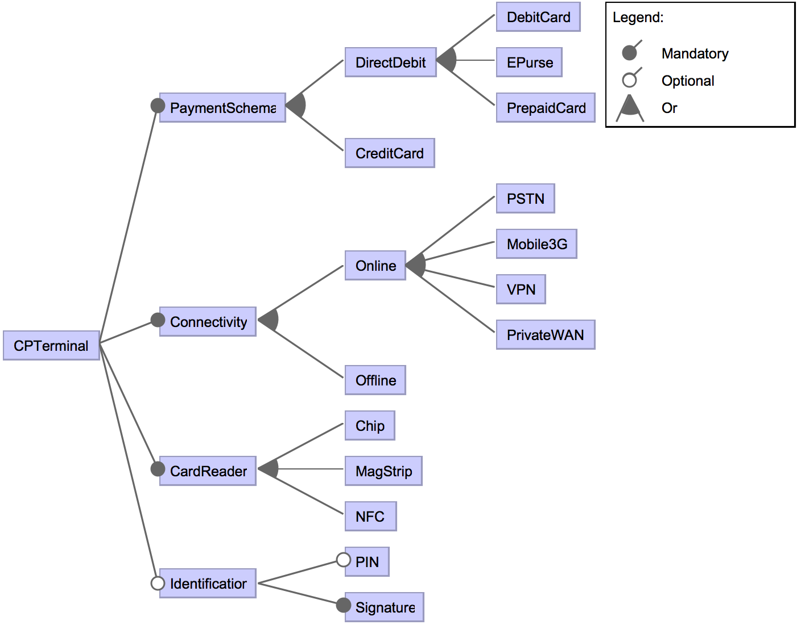

# Card Payment Terminal


## Description

The feature model of a card payment terminal has been manually defined using Eurocard-Mastercard-Visa (EMV) specification document. This machine accepts card payment with a given payment schema (direct debit and/or credit card). It works online, using one or more connectivity option, or offline with the card payment service. Cards are read using a chip, the magnetic strip, or near field contact (NFC); and card owner may be authenticated using signature and optionally PIN code.

The FTS presents the behaviour (we want to test) of the card payment terminal to processes a payment. First, the Card Holder (CH), i.e., the user, inserts his card in the terminal. If the card is a direct debit or a credit card, the terminal will proceed the initialisation of the transaction. In this version of the product line, the card holder must always identify himself using either: his signature if the card is not a direct debit card and if the terminal supports the signature identification; or his secret PIN if the terminal supports PIN identification, which may be checked online or offline with the transaction processor company. If the identification succeeds, the terminal will proceed online or offline to the payment, otherwise, the transaction is aborted. Whether the transaction succeeds or not, the card holder removes his card from the terminal at the end of the process.


### Reference

Devroey, X., Perrouin, G., Legay, A., Schobbens, P.-Y. and Heymans, P. 2016. [Search-based Similarity-driven Behavioural SPL Testing](https://doi.org/10.1145/2866614.2866627). Proceedings of the Tenth International Workshop on Variability Modelling of Software-intensive Systems - VaMoS ’16 (Salvador, Brazil, Jan. 2016), 89–96.

```TeX
@inproceedings{Devroey2016,
	author = {Devroey, Xavier and Perrouin, Gilles and Legay, Axel and Schobbens, Pierre-Yves and Heymans, Patrick},
	title = {{Search-based Similarity-driven Behavioural SPL Testing}},
	booktitle = {Proceedings of the Tenth International Workshop on Variability Modelling of Software-intensive Systems - VaMoS '16},
	year = {2016}
	month = {jan},
	address = {Salvador, Brazil},
	pages = {89--96},
	publisher = {ACM Press},
	doi = {10.1145/2866614.2866627}
}

```

## Feature Model



## Content:

- cpterminal.tvl: the variability model in TVL (https://projects.info.unamur.be/tvl/)
- cpterminal.png: a graphical representation of the variability model
- cpterminal.splot.xml: the variability model encoded in SPLOT (http://www.splot-research.org)
- cpterminal.splot.dimacs: the dimacs representation of the variability model, generated from PLEDGE (http://research.henard.net/SPL/PLEDGE/)
- cpterminal.usagemodel: the handcrafted usage model
- cpterminal.fts: the FTS
- cpterm-fm-simplified.pdf: a simplified feature model.
- cpterm-fts-simplified.pdf: a simplified featured transition system.
- cpterminaldiag.graffle: editable graphical representations of the FTS and the FD
