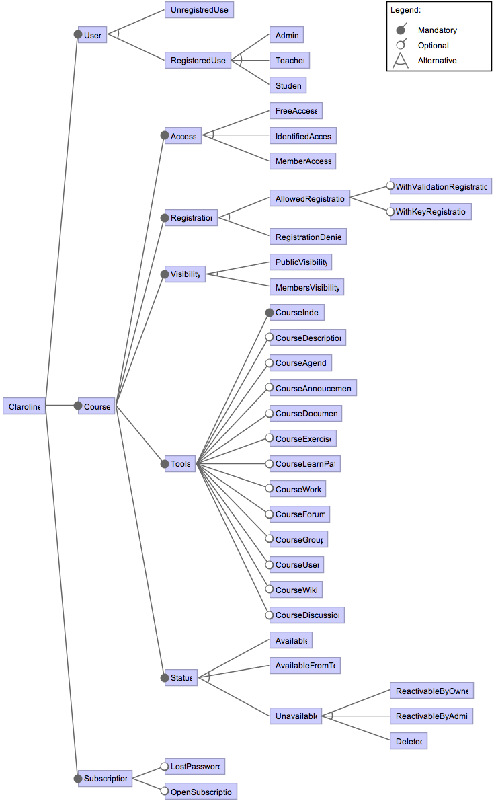

# Claroline


## Description

The [instance of Claroline](http://webcampus.unamur.be) at University of Namur is the main communication channel between students and lecturers and is used by approximately 7000 users in 2015. Students may register to courses and download documents, receive announcements, submit their assignments, perform online exercises, etc. 
[Claroline](https://www.claroline.net) is a configurable system. Contrary to classical SPL, the selection of the features does not occur during the development of the software (at design time in a SPL lifecycle), but during its execution (at runtime). Thus, a product can dynamically evolve while the system is running: this requires the system architecture to be able to accommodate evolutions, by following plugin-based or component-based architectural styles. Thanks to the versatility of the feature concept, it is possible to represent design time and runtime product using the same formalism (FM), as product semantics is ultimately given through the mapping with the FTS. In the Claroline case, features represent installation parameters. A product represents a running Claroline instance with a minimal set of data.  


### Reference

Devroey, X., Perrouin, G., Cordy, M., Samih, H., Legay, A., Schobbens, P.-Y. and Heymans, P. 2017. [Statistical prioritization for software product line testing: an experience report](https://doi.org/10.1007/s10270-015-0479-8). Software & Systems Modeling. 16, 1 (Feb. 2017), 153–171.

```TeX
@article{Devroey2017,
	author = {Devroey, Xavier and Perrouin, Gilles and Cordy, Maxime and Samih, Hamza and Legay, Axel and Schobbens, Pierre-Yves and Heymans, Patrick},
	title = {{Statistical prioritization for software product line testing: an experience report}},
	journal = {Software {\&} Systems Modeling},
	volume = {16},
	number = {1},
	pages = {153--171},
	month = {feb},
	year = {2017},
	publisher = {Springer}
}
```

## Feature Model



We manually built the FM from the Claroline documentation and from inspection of a locally installed Claroline instance (Claroline 1.11.7) in approximately 3 days (by one person). The FM (additional constraints have been omitted) describes Claroline with three main features: User, Course and Subscription. Subscription may be open to everyone (opt OpenSubscription) and may have a password recovery mechanism (opt LostPassword). 

User corresponds to the different possible user types provided by default with a basic Claroline installation: unregistered users (UnregisteredUser) who may access courses open to everyone and registered users (RegisteredUser) who may access different functionalities of the courses according to their privilege level (Student, Teacher or Admin). The last main feature, Course, corresponds to the page dedicated to a course where students and teacher may interact.

A course has a status (Available, AvailableFromTo if the course is available only during a specific period, or Unavailable), may be publicly visible (PublicVisibility) or not (MembersVisibility), may authorize registration to identified users (AllowedRegistration) or not (RegistrationDenied) and may be accessed by everyone (FreeAccess), identified users (IdentifiedAccess) or members of the course only (MembersAccess). Moreover, a course may have a list of tools (Tools) used for different teaching purposes, e.g., an agenda (opt CourseAgenda), an announcement panel (opt CourseAnnoucements), a document download section where lecturers may post documents and students may download them (opt CourseDocument), an online exercise section (opt CourseExercise).
 
Since we are in a testing context, one product of the FM does not represent a complete Claroline instance, but the minimal instance needed to play a test suite. Basically, it maps to a Claroline instance with one particular user and one particular course.
This is similar to the technique presented by [Segura et al.](https://dl.acm.org/citation.cfm?doid=2642937.2642939) used to represent the testing entry domain of a e-commerce web site.
In order to represent a complete Claroline instance (with all its users and courses), we need to introduce cardinalities on the User and  Course features in order to have multiple users and multiple courses. Eventually we obtained a FM with 44 features.


## Featured transition system

Regarding the FTS, we used a bigram inference method on a 5.26 Go Apache webserver log with 45,210,987 entries from January 2013 to September 2013. We only consider the resource names in the user sessions. This simplification is coherent with our testing context where the FM is used to map a Claroline instance with one particular user and one particular course.

Transitions have been tagged manually (in the produced model) with feature expressions based on the knowledge of the system (via the documentation and the local Claroline instance). As for the WordPress models, we added an initial state s\_0, but made all states in the FTS accessible from s\_0. This allows to simulate a web browser access both to the root page or directly to a sub-page of the website (e.g., from a direct link sent in an email), which is a very common way to access Webcampus. The final FTS consists of 106 states and 2053 transitions and has been built in approximately 4 days.

## Content:

- claroline.tvl: the variability model in TVL (https://projects.info.unamur.be/tvl/)
- claroline-fd.png: a graphical representation of the variability model
- claroline.splot.xml: the variability model encoded in SPLOT (http://www.splot-research.org)
- claroline.splot.dimacs: the dimacs representation of the variability model, generated from PLEDGE (http://research.henard.net/SPL/PLEDGE/)
- claroline-RR.usagemodel: the claroline usage model build using RR 2-gram inference.
- claroline-RRN.usagemodel: the claroline usage model build using RRN 2-gram inference.
- claroline.usagemodel: the usage model derived from claroline-RR.usagemodel to match actions in claroline.fts
- claroline.fts: the FTS