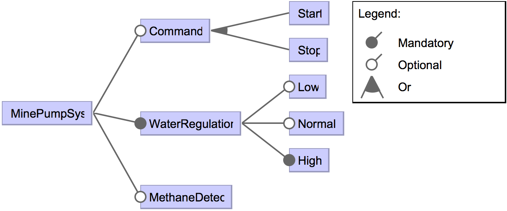

# Mine pump


## Description

The [mine pump model](https://projects.info.unamur.be/fts/) represents a product line of pumps designed to keep a mine shaft clear of water and (optionally) avoid the danger of a methane explosion. A pump has a water regulator that can detect the level of water in the shaft. It may be equipped with a methane detector and a command interface allowing to manually start and stop the pump. The FTS describing the behaviour of the pumps has 25 states and 41 transitions. 


### Reference

Classen, A. 2010. [Modelling with FTS: a Collection of Illustrative Examples](https://projects.info.unamur.be/fts/). PReCISE Research Center, University of Namur (technical report P-CS-TR SPLMC-00000001).

```TeX
@techreport{Classen2010b,
	author = {Classen, Andreas},
	title = {{Modelling with FTS: a Collection of Illustrative Examples}},
	institution = {PReCISE Research Center, University of Namur},
	number = {P-CS-TR SPLMC-00000001},
	address = {Namur, Belgium},
	url = {https://projects.info.unamur.be/fts/publications/},
	year = {2010}
}
```

## Feature Model



## Content:

- minepump.tvl: the variability model in TVL (https://projects.info.unamur.be/tvl/)
- minepump-fm: a graphical representation of the variability model
- minepump.splot.xml: the variability model encoded in SPLOT (http://www.splot-research.org)
- minepump.splot.dimacs: the dimacs representation of the variability model, generated from PLEDGE (http://research.henard.net/SPL/PLEDGE/)
- minepump.usagemodel: the handcrafted usage model
- minepump.fts: the FTS
