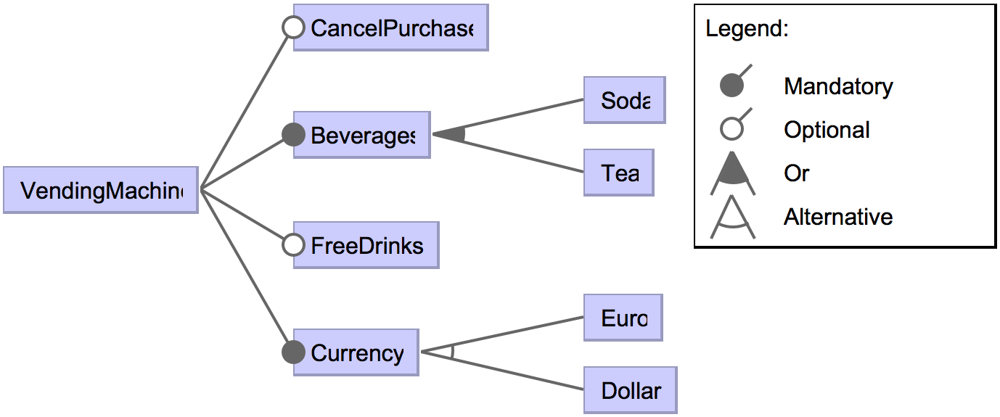
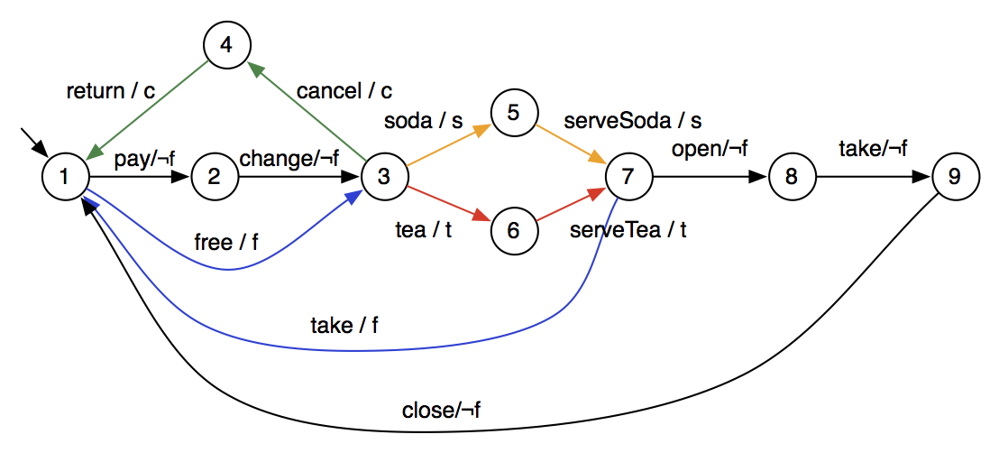

# Soda Vending Machine


## Description

The soda vending machine is a classical beverage vending machine SPL described by [Classen et al.]((https://projects.info.unamur.be/fts/)). It sells soda or tea in euro or dollar, may offer free drinks, and optionally allows to cancel a purchase. The user either pays or chooses a free drink (if feature Free has been selected); he may cancel its purchase (if feature Cancel has been selected); he chooses a beverage, allowed by the selected features; and gets his beverage directly (if feature Free has been selected) of after opening the machine (otherwise).

### Reference

Classen, A. 2010. [Modelling with FTS: a Collection of Illustrative Examples](https://projects.info.unamur.be/fts/). PReCISE Research Center, University of Namur (technical report P-CS-TR SPLMC-00000001).

```TeX
@techreport{Classen2010b,
	author = {Classen, Andreas},
	title = {{Modelling with FTS: a Collection of Illustrative Examples}},
	institution = {PReCISE Research Center, University of Namur},
	number = {P-CS-TR SPLMC-00000001},
	address = {Namur, Belgium},
	url = {https://projects.info.unamur.be/fts/publications/},
	year = {2010}
}
```

## Feature Model



## Featured Transition System



## Content:

- svm.tvl: the variability model in TVL (https://projects.info.unamur.be/tvl/)
- svm-fm: a graphical representation of the variability model
- svm.splot.xml: the variability model encoded in SPLOT (http://www.splot-research.org)
- svm.splot.dimacs: the dimacs representation of the variability model, generated from PLEDGE (http://research.henard.net/SPL/PLEDGE/)
- svm.usagemodel: the handcrafted usage model
- svm.fts: the FTS
- svm-fts: a graphical representation of the FTS model
