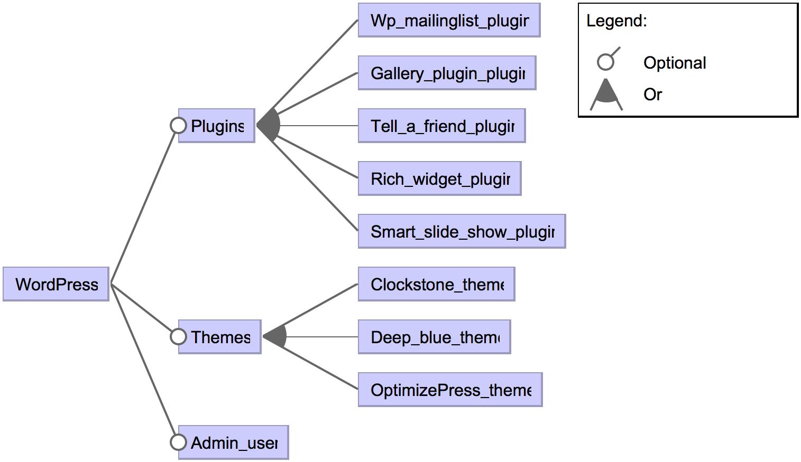
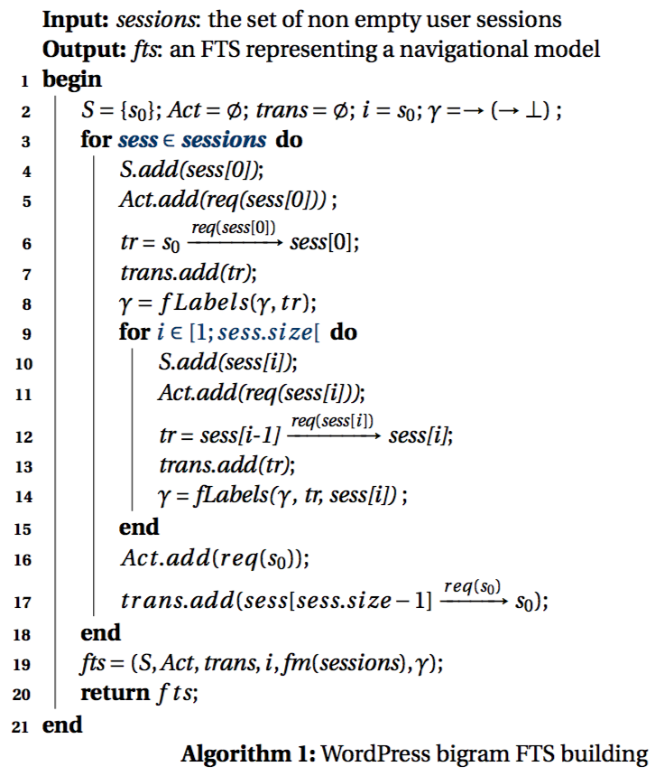

# WordPress, an open-source CMS


## Description

[WordPress](https://wordpress.org) is a popular open-source Content Management System (CMS) used by more than 60 million websites. It includes a plugin architecture and a template system, allowing one to modify its behaviour by adding new functionalities (i.e., plugins), or the rendering of the website (i.e., themes), respectively. In February 2017, the WordPress database counted 48,898 plugins and 4,462 (latest) themes. 

We reverse-engineered the feature models and the FTSs of two WordPress instances, AGE and Elsa portals, based on their Apache webserver log file. The [AGE website](http://www.age-namur.be) is the portal of the general student assembly of the University of Namur. It uses a dedicated WordPress instance and provided us a log file with 1,285,592 entries from May 2013 to March 2014. The [European Law Students' Association (Elsa) of Louvain-la-Neuve](http://elsa-lln.be) also uses a dedicated WordPress instance and provided us a log with 48,823 entries from February 2014 to the end of April 2014.

## Feature Model



Our WordPress feature model has 3 optional core features: Plugins, Themes, and Admin\_user. One configuration (i.e., product) of the feature models represents the minimal instance needed to play a test suite. The Admin\_user feature will be selected only if a test case requires to access the administration pages. 

To identify the plugins and themes used in the instances, we analysed the Apache webserver log entries. Each time an HTTP request is addressed to the server, one entry is created in the log file with the following format: the IP address of the visitor sending the request; a login if the visitor is identified on the system; the date and time of the request; the HTTP request itself, beginning with  GET, POST, etc., followed by a URL and the protocol version; the status code sent back to the client; the size of the object returned to the client; the website the client reports having been referred from; and finally the information on the client's browser. For instance, a request to the `index.php` page of the WordPress instance from a Mozilla Firefox navigator will add the following entry in the log file:

```
66.155.40.250 - - [08/Nov/2013:11:38:11 +0100] "GET /index.php?p=potins&action=aimepas&id=135 HTTP/1.1" 200 708388 "-" "Mozilla/5.0 (Windows NT 6.1; WOW64; rv:25.0) Gecko/20100101 Firefox/25.0"
```

Plugins and themes resources are placed in specific folders on the webserver. This allows us to filter the URL of the log entries using the following regular expressions:

- `.*/wp-content/plugins/([^/]+)/.*` to detect access to a plugin resource;
- `.*/wp-content/themes/([^/]+)/.*` to detect access to themes resources;
- `.*/wp-admin/.*` to detect that an administration page has been used.

The names of the plugins and themes appears right after the `plugins/` and `themes/` part of the URL (matched by the `([^/]+)` part of the regular expression). Since the logs have been anonymized, we do not have the identification of the users and rely on the last regular expression to detect administrator accesses to the WordPress instance.

We ended up with two feature models: one with 45 features for the AGE WordPress instance, and one with 70 features for the Elsa WordPress instance.
The root feature WordPress is decomposed in three optional sub-features: Admin\_user, Themes, and Plugins. Each plugin or theme (resp.) appearing in a log entry will be a sub-feature of the Plugins or Themes (resp.) feature. 

## Featured Transition System

We reverse engineered the FTSs of the AGE and Elsa WordPress instances using a 2-gram (bigram) inference method. This method uses a set of user sessions (i.e., sequences of HTTP requests) to generate a navigational model of a website. In the generated FTS, the states represents the last user request and the transitions represents the sequence between two requests. Transitions leading to a request identified as part of a plugin or a theme, or as accessible only by an administrator (using the regular expressions from the previous section) are labelled with the corresponding feature expression.

The n-gram inference method has been proposed by [Sprenkle et al.](http://dx.doi.org/10.1002/stvr.1496) and used to test website in a black box fashion. They experiment the inference with different configurations and values of *n* greater than 2 and found out that a small *n* allows better diversity in the behaviours (ending up in more diverse test cases), and requires less sessions to reach growth stability of the model. Small *n* also simplifies the generation and results in a more compact model. This motivates our choice to select 2-gram for the inference.

### User sessions

One user session corresponds to a sequence of HTTP requests, representing the sequence of pages consulted by the user. User sessions can be extracted from the Apache webserver log by grouping entries with the same IP address (assuming that one IP corresponds to one user) and logged within a same time frame. This means that two entries in a user session may not be distant by more than a maximal timeout (we arbitrarily choose to set a timeout of 3 minutes). If the timeout is reached, the next entry will be the first of a new user session.

To build the user sessions, we only consider some relevant elements of the HTTP request. This allows to group behaviour of various users to identify common usage scenarios. Amongst the possible group of elements, we considered:

- Request type and Resource (RR), which uses the type of HTTP request (e.g., `POST` or `GET`) and the resource name (e.g., `/index.php`) for a user session element;
- Request type, Resource, and parameters Names (RRN), which also uses the HTTP request type and the name of the resource, but also the name of the parameters in the resource (e.g., `?p=&action=&id=`).

#### Bigram inference



Using a bigram inference, the next state only depends on the current state of the system. As a consequence, user session entries are considered two by two: the last user request, which is the current state, and the next request of the user, which is the next state of the system.

Algorithm presents the bigram inference of the FTS for a WordPress instance, based on a set of user sessions. The elements of the FTS are initialised. For each session, the sequence of requests enriches the model: sessions starts from a virtual state *s0* and the first sequence adds a transition from this state to a new state corresponding to the first element of the sequence; transitions are labelled with actions representing the request of another page; and each new transition is labelled with a feature expression. 
This feature expression corresponds to the conjunction of the previous feature expression if there is one or true otherwise, and the  name of a plugin, a theme, or the administrator user if the requested resource matches one of the corresponding regular expression. Function `fLabels` enriches *gamma* definition, based on its previous definition and the given transition. 
This process iterates for each request in the sequence, the starting state corresponding to the target state of the previous iteration. Finally, each sequence terminates by a special action *req(s0)*, resetting the system, and ends in the virtual state *s0*. The algorithm returns an FTS with the inferred navigational model and a feature diagram. We implemented Algorithm in an open source tool: [Yet Another Model Inference tool (YAMI)](https://github.com/xdevroey/yami).

We built four FTSs: two using Request type and Resource (RR) parts of the URLs as sequence elements in the user sessions (*AGE-RR* with 772 states and 6,639 transitions, and *Elsa-RR* with 384 states and 1,214 transitions), and two using Request type, Resource, and parameter Names (RRN) parts of the URLs (*AGE-RRN* with 1,101 states and 10,960 transitions, and *Elsa-RRN* with 615 states and 1,771 transitions). The process took 3 seconds to process the 3,964 sessions of the Elsa models (average session size=9.57, *sigma*=46.73) and 54 second to build the 147,173 sessions of the AGE models (average session size=5.10, *sigma*=61.04) on a Ubuntu Linux machine (Linux version 3.13.0-65-generic, Ubuntu 4.8.2-19ubuntu1) with an Intel Core i3 (3.10GHz) processor and 4GB of memory.


## Reference

Devroey, X., Perrouin, G., Papadakis, M., Legay, A., Schobbens, P.-Y. and Heymans, P. 2018. [Model-based mutant equivalence detection using automata language equivalence and simulations](https://doi.org/10.1016/j.jss.2018.03.010). Journal of Systems and Software. 141, (Jul. 2018), 1–15.

```TeX
@article{Devroey2018,
	author = {Devroey, Xavier and Perrouin, Gilles and Papadakis, Mike and Legay, Axel and Schobbens, Pierre-Yves and Heymans, Patrick},
	title = {{Model-based mutant equivalence detection using automata language equivalence and simulations}},
	journal = {Journal of Systems and Software},
	year = {2018},
	month = {jul},
	volume = {141},
	pages = {1--15},
	publisher = {Elsevier}
}
```
