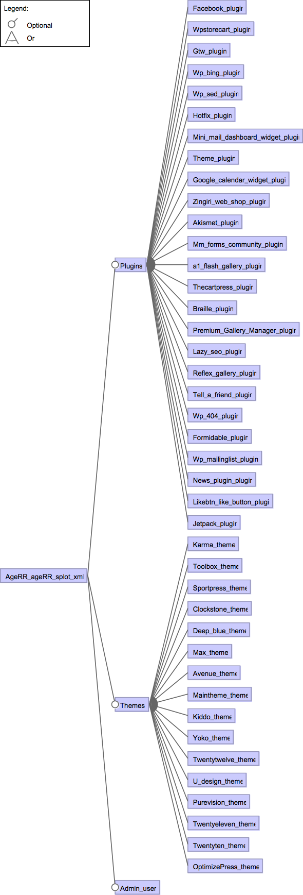

# Wordpress AGE RR

## Content:

- ageRR.tvl: the variability model in TVL (https://projects.info.unamur.be/tvl/)
- ageRR-fd.png: a graphical representation of the variability model
- ageRR.splot.xml: the variability model encoded in SPLOT (http://www.splot-research.org)
- ageRR.splot.dimacs: the dimacs representation of the variability model, generated from PLEDGE (http://research.henard.net/SPL/PLEDGE/)
- ageRR.usagemodel: the usage model derived from claroline-RR.usagemodel to match actions in claroline.fts
- ageRR.fts: the FTS
- ageRR.ts: the TS (FTS without feature expressions) for testing purpose.

## Feature Model

