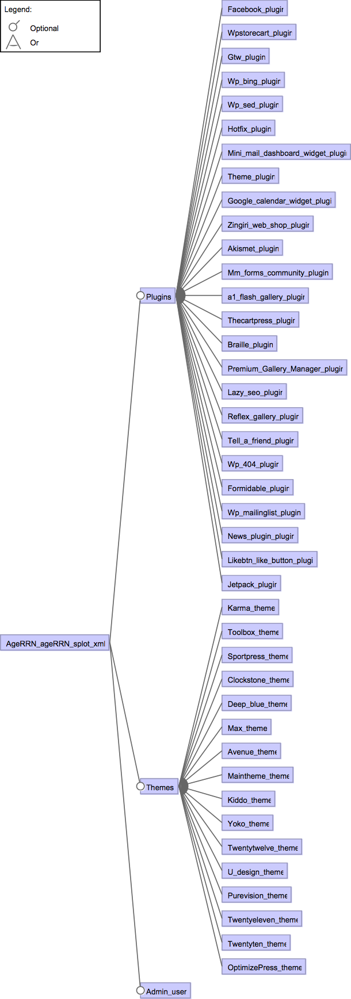

# Wordpress AGE RRN

## Content:

- ageRRN.tvl: the variability model in TVL (https://projects.info.unamur.be/tvl/)
- ageRRN-fd.png: a graphical representation of the variability model
- ageRRN.splot.xml: the variability model encoded in SPLOT (http://www.splot-research.org)
- ageRRN.splot.dimacs: the dimacs representation of the variability model, generated from PLEDGE (http://research.henard.net/SPL/PLEDGE/)
- ageRRN.usagemodel: the usage model derived from claroline-RRN.usagemodel to match actions in claroline.fts
- ageRRN.fts: the FTS
- ageRRN.ts: the TS (FTS without feature expressions) for testing purpose.

## Feature Model

